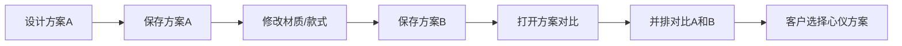

# 全屋定制衣柜3D预览工具 - 产品需求文档

## 1. 产品概述

本产品是一款面向全屋定制衣柜门店导购的轻量化3D预览工具，无需后端服务，素材资源云端预存，支持电脑和平板设备访问。通过直观的3D可视化展示，帮助客户更清晰地想象衣柜安装后的实际效果，降低导购成交难度，提升客户体验和签单转化率。

### 1.1 核心价值
- **解决痛点**：传统图纸、样品册展示方式难以让客户直观感受空间效果
- **目标用户**：全屋定制门店导购、设计师、终端客户
- **使用场景**：门店导购接待、方案沟通、客户自助预览

---

## 2. 核心功能

### 2.1 用户角色
| 角色 | 使用方式 | 核心权限 |
|------|----------|----------|
| 导购员 | 浏览器直接访问 | 完整操作权限：户型调整、组件拖拽、材质切换、报价核算、方案导出 |
| 终端客户 | 导购引导操作 | 浏览3D效果、切换材质款式、对比方案、查看报价 |

### 2.2 功能模块总览
1. **3D场景主界面**：中央3D渲染区、左侧组件库、右侧属性面板、顶部工具栏
2. **户型预设系统**：主卧、次卧、衣帽间三种常用户型毛坯空间
3. **衣柜组件库**：柜体板材、柜门样式、五金配件、隔板配件四大类
4. **拖拽拼接系统**：自由拖拽组件拼装衣柜结构，实时3D渲染
5. **材质切换系统**：板材颜色、柜门款式自由切换
6. **方案对比功能**：一键对比多款设计方案
7. **自动报价系统**：根据柜体尺寸测算板材面积、五金用量，实时核算报价
8. **效果图导出**：生成方案效果图，保存图片发送客户
9. **光照模拟系统**：白天、傍晚两种光照模式切换
10. **性能优化**：轻量化渲染，低配办公设备流畅运行

### 2.3 页面/模块详情

| 模块名称 | 子模块 | 功能描述 |
|---------|--------|----------|
| 3D主场景 | 场景渲染区 | 实时3D渲染衣柜和房间，支持旋转、缩放、平移视角 |
| 3D主场景 | 视角控制 | 鼠标/触摸拖拽旋转、滚轮缩放、右键平移、预设视角按钮 |
| 左侧组件库 | 分类标签 | 柜体、柜门、五金、隔板四大分类切换 |
| 左侧组件库 | 组件列表 | 各分类下的3D组件缩略图，支持拖拽到场景 |
| 左侧组件库 | 搜索筛选 | 关键词搜索组件，按风格/材质筛选 |
| 右侧属性面板 | 户型参数 | 调整房间长宽高尺寸 |
| 右侧属性面板 | 选中对象属性 | 修改选中柜体/柜门的尺寸、颜色、位置等 |
| 右侧属性面板 | 光照设置 | 切换白天/傍晚光照模式 |
| 右侧属性面板 | 报价面板 | 实时显示板材面积、五金用量、总价明细 |
| 顶部工具栏 | 户型切换 | 主卧/次卧/衣帽间三种预设户型快速切换 |
| 顶部工具栏 | 方案管理 | 保存方案、加载方案、方案对比 |
| 顶部工具栏 | 导出功能 | 导出效果图图片 |
| 顶部工具栏 | 撤销重做 | 操作撤销/重做 |
| 方案对比弹窗 | 对比视图 | 2-4个方案并排对比展示 |
| 方案对比弹窗 | 方案管理 | 添加/移除对比方案 |

---

## 3. 核心流程

### 3.1 导购操作主流程

```mermaid
flowchart LR
    A["打开工具"] --> B["选择预设户型"]
    B --> C["微调房间尺寸"]
    C --> D["从组件库拖拽柜体"]
    D --> E["拼接衣柜结构"]
    E --> F["调整柜体尺寸"]
    F --> G["选择板材颜色"]
    G --> H["选择柜门款式"]
    H --> I["添加五金/隔板配件"]
    I --> J["实时查看报价"]
    J --> K["切换光照模式"]
    K --> L["保存设计方案"]
    L --> M["导出效果图"]
    M --> N["发送给客户"]
```

### 3.2 方案对比流程

---

## 4. 用户界面设计

### 4.1 设计风格
- **设计定位**：专业、现代、简洁的工具型界面
- **主色调**：深胡桃木色 #5D4037 作为主色，体现木质家居质感
- **辅助色**：暖金色 #FFB74D 作为强调色，用于选中状态和操作按钮
- **背景色**：浅灰色 #F5F5F5 背景，深灰色 #333333 文字
- **按钮风格**：圆角矩形按钮，轻微阴影，悬停有上浮效果
- **字体**：中文使用思源黑体，英文使用 Roboto，清晰易读
- **布局风格**：三栏式布局，左中右结构，顶部工具栏
- **图标风格**：线性风格图标，简洁现代

### 4.2 页面设计概述

| 页面/模块 | 设计要点 |
|-----------|----------|
| 整体布局 | 三栏式：左侧280px组件库 + 中间自适应3D场景 + 右侧320px属性面板 |
| 顶部工具栏 | 60px高度，深胡桃木色背景，白色图标文字，左侧logo，中间工具按钮，右侧用户信息 |
| 左侧组件库 | 白色卡片式设计，分类标签页，组件网格布局，卡片悬停有阴影和边框高亮 |
| 3D场景区 | 浅灰色背景，底部有操作提示，右下角有视角控制按钮组 |
| 右侧属性面板 | 白色背景，分组折叠面板，数值输入框+滑块组合调节 |
| 报价面板 | 突出显示，暖金色背景，大号字体显示总价，明细可展开 |
| 方案对比弹窗 | 全屏模态框，网格布局展示方案，每个方案带标题和操作按钮 |

### 4.3 响应式设计
- **桌面端**：三栏完整布局，1280px以上完美展示
- **平板端**：左侧组件库可收起为图标栏，右侧面板可折叠，触控优化
- **触控支持**：所有拖拽、缩放操作支持触摸手势
- **自适应**：3D场景区域自动适应剩余空间

### 4.4 3D场景设计指引

#### 环境与氛围
- **整体基调**：温暖、明亮、真实的家居氛围
- **背景**：浅灰色渐变背景，不喧宾夺主
- **地面**：浅木地板纹理，带轻微反光
- **墙面**：白色/米白色乳胶漆质感

#### 光照设置
- **白天模式**：模拟自然光，主光源来自左上方45度，暖白色色温5500K，柔和阴影，环境光充足
- **傍晚模式**：模拟黄昏暖光，主光源偏暖黄色3200K，阴影拉长，环境光偏暗，添加室内辅助光源

#### 相机设置
- **初始视角**：透视相机，45度俯视视角，房间对角线方向
- **控制方式**：OrbitControls轨道控制，支持旋转、缩放、平移
- **限制**：最小缩放距离2米，最大10米，俯仰角限制10-85度
- **预设视角**：正视图、侧视图、俯视图、透视图四个快捷按钮

#### 性能优化
- **几何体**：使用简化几何体，避免过多面数
- **材质**：使用MeshStandardMaterial，适当降低粗糙度贴图精度
- **阴影**：使用PCFSoftShadowMap，适当降低阴影贴图分辨率
- **LOD**：远景物体使用低精度模型
- **渲染**：自适应像素比，低配设备自动降低渲染质量

---

## 5. 素材资源规划

### 5.1 柜体组件
- 标准柜体单元（宽600/800/1000mm）
- 转角柜体
- 顶柜/底柜
- 抽屉单元

### 5.2 柜门样式
- 平板门
- 模压门（简约线条）
- 百叶门
- 玻璃门（透明/磨砂）
- 推拉门

### 5.3 板材材质
- 白色双饰面
- 浅胡桃木
- 深胡桃木
- 橡木纹
- 灰色水泥纹
- 暖白色吸塑

### 5.4 五金配件
- 拉手（长拉手/小圆拉手）
- 铰链
- 导轨
- 挂衣杆
- 裤架

### 5.5 隔板配件
- 固定层板
- 活动层板
- 抽屉分隔
- 领带格
- 首饰盒
