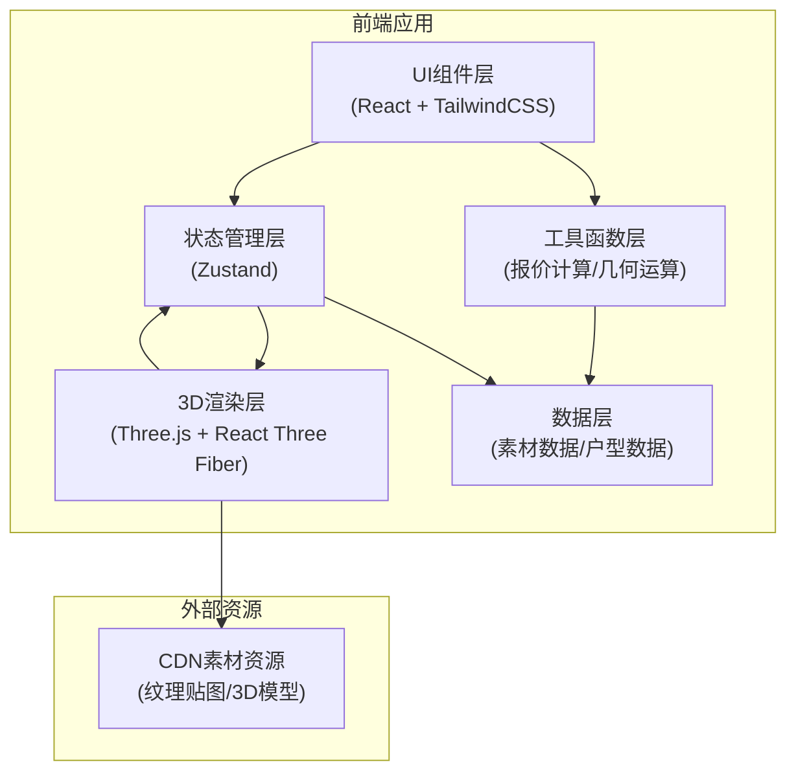

# 全屋定制衣柜3D预览工具 - 技术架构文档

## 1. 架构设计



### 架构说明
- **纯前端架构**：无后端服务，所有逻辑在浏览器端运行
- **数据存储**：素材数据内置在前端代码中，纹理资源通过CDN加载
- **状态管理**：Zustand统一管理应用状态（户型、衣柜组件、选中状态、报价等）
- **3D渲染**：React Three Fiber封装Three.js，声明式构建3D场景
- **本地存储**：方案数据通过localStorage持久化

---

## 2. 技术栈说明

### 2.1 核心技术
| 技术 | 版本 | 用途 |
|------|------|------|
| React | 18.x | 前端UI框架 |
| TypeScript | 5.x | 类型安全 |
| Vite | 5.x | 构建工具 |
| TailwindCSS | 3.x | CSS框架 |
| Three.js | 0.160.x | 3D渲染引擎 |
| @react-three/fiber | 8.x | React的Three.js渲染器 |
| @react-three/drei | 9.x | Three.js常用组件库 |
| @react-three/postprocessing | 2.x | 后期处理效果 |
| Zustand | 4.x | 状态管理 |
| lucide-react | 0.294.x | 图标库 |

### 2.2 初始化方式
使用 `vite-init` 的 `react-ts` 模板初始化项目，在此基础上添加Three.js相关依赖。

---

## 3. 路由定义

本项目为单页应用，主要通过组件切换实现不同功能视图，不使用路由系统。

| 视图 | 说明 |
|------|------|
| 主编辑视图 | 默认视图，包含完整三栏布局和3D场景 |
| 方案对比弹窗 | 模态框形式展示，无需独立路由 |

---

## 4. 数据模型

### 4.1 户型数据模型

```typescript
interface RoomConfig {
  id: string;
  name: string;
  type: 'master' | 'second' | 'walkin'; // 主卧/次卧/衣帽间
  width: number;  // 房间宽度 (mm)
  depth: number;  // 房间深度 (mm)
  height: number; // 房间高度 (mm)
  wallColor: string;
  floorColor: string;
}
```

### 4.2 衣柜组件数据模型

```typescript
interface CabinetComponent {
  id: string;
  name: string;
  category: 'cabinet' | 'door' | 'hardware' | 'shelf';
  type: string; // 具体类型，如 'standard', 'corner', 'drawer'
  width: number;   // 标准宽度 (mm)
  height: number;  // 标准高度 (mm)
  depth: number;   // 深度 (mm)
  price: number;   // 单价
  material?: string;
  thumbnail?: string;
}
```

### 4.3 已放置组件模型

```typescript
interface PlacedComponent {
  id: string; // 实例ID
  componentId: string; // 组件模板ID
  position: { x: number; y: number; z: number }; // 3D位置
  rotation: { x: number; y: number; z: number }; // 旋转
  scale: { x: number; y: number; z: number };    // 尺寸缩放
  material: string;  // 当前材质
  color: string;     // 当前颜色
  doors?: PlacedDoor[]; // 柜门
  shelves?: PlacedShelf[]; // 隔板
  hardware?: PlacedHardware[]; // 五金
}
```

### 4.4 材质数据模型

```typescript
interface Material {
  id: string;
  name: string;
  category: 'board' | 'door' | 'hardware';
  color: string;     // 基础颜色
  texture?: string;  // 纹理贴图URL
  roughness: number;
  metalness: number;
  pricePerSqm: number; // 每平米价格
}
```

### 4.5 方案数据模型

```typescript
interface DesignScheme {
  id: string;
  name: string;
  createdAt: number;
  room: RoomConfig;
  components: PlacedComponent[];
  lightingMode: 'day' | 'evening';
  thumbnail?: string;
}
```

### 4.6 报价数据模型

```typescript
interface QuoteItem {
  name: string;
  quantity: number;
  unit: string;
  unitPrice: number;
  totalPrice: number;
}

interface QuoteResult {
  boardArea: number; // 板材总面积 (㎡)
  boardPrice: number;
  hardwareItems: QuoteItem[];
  hardwareTotal: number;
  laborPrice: number;
  totalPrice: number;
}
```

### 4.7 应用状态模型

```typescript
interface AppState {
  // 户型
  room: RoomConfig;
  
  // 已放置的组件
  components: PlacedComponent[];
  
  // 当前选中的组件ID
  selectedComponentId: string | null;
  
  // 当前拖拽中的组件
  draggingComponent: CabinetComponent | null;
  
  // 光照模式
  lightingMode: 'day' | 'evening';
  
  // 方案列表
  schemes: DesignScheme[];
  
  // 对比模式
  compareMode: boolean;
  compareSchemes: string[];
  
  // 报价结果
  quote: QuoteResult;
}
```

---

## 5. 目录结构

```
src/
├── components/          # UI组件
│   ├── TopToolbar/      # 顶部工具栏
│   ├── ComponentPanel/  # 左侧组件库面板
│   ├── PropertyPanel/   # 右侧属性面板
│   ├── QuotePanel/      # 报价面板
│   ├── CompareModal/    # 方案对比弹窗
│   └── ViewControls/    # 视角控制
├── store/               # 状态管理
│   └── useStore.ts      # Zustand store
├── scene/               # 3D场景相关
│   ├── Scene.tsx        # 主3D场景组件
│   ├── Room.tsx         # 房间模型
│   ├── Cabinet.tsx      # 柜体模型
│   ├── Door.tsx         # 柜门模型
│   ├── Hardware.tsx     # 五金模型
│   ├── Shelf.tsx        # 隔板模型
│   ├── Lights.tsx       # 灯光系统
│   └── Camera.tsx       # 相机控制
├── data/                # 数据素材
│   ├── rooms.ts         # 预设户型数据
│   ├── components.ts    # 组件库数据
│   ├── materials.ts     # 材质数据
│   └── prices.ts        # 价格数据
├── utils/               # 工具函数
│   ├── quote.ts         # 报价计算
│   ├── geometry.ts      # 几何运算
│   └── export.ts        # 导出工具
├── types/               # 类型定义
│   └── index.ts
├── App.tsx
├── main.tsx
└── index.css
```

---

## 6. 核心功能实现方案

### 6.1 拖拽拼接实现
- 使用 HTML5 Drag & Drop API 实现组件从左侧面板拖拽
- 3D场景中使用 Raycaster 进行鼠标位置拾取
- 拖拽过程中显示半透明预览模型，吸附到墙面/地面
- 释放鼠标时根据吸附位置放置组件

### 6.2 报价计算实现
- 监听状态中components变化，自动重新计算
- 板材面积：根据柜体尺寸展开面积计算
- 五金用量：根据组件类型和尺寸自动统计
- 价格累加：物料价格 + 人工费 + 其他费用

### 6.3 光照模式切换
- 两套光照配置：白天模式和傍晚模式
- 切换时使用动画过渡，避免突兀
- 白天：DirectionalLight + 高亮度AmbientLight
- 傍晚：暖色调DirectionalLight + PointLight模拟室内灯光

### 6.4 效果图导出
- 使用 Three.js 的 renderer.domElement.toDataURL()
- 支持自定义导出分辨率
- 自动添加水印和方案名称

### 6.5 性能优化
- 使用 InstancedMesh 渲染重复组件
- 适当降低阴影贴图分辨率
- 使用材质克隆而非重复创建
- 监听设备性能，自动调整渲染质量
- 组件简化模型，面数控制在合理范围

---

## 7. 素材资源方案

由于是纯前端项目且素材云端预存：

1. **3D模型**：使用 Three.js 程序化生成基础几何体，无需外部模型文件
2. **纹理贴图**：木纹、金属等纹理通过 CDN 加载，使用 URL 配置
3. **程序化纹理**：简单纹理通过 Canvas 程序化生成，减少网络请求
4. **降级方案**：纹理加载失败时使用纯色材质降级
